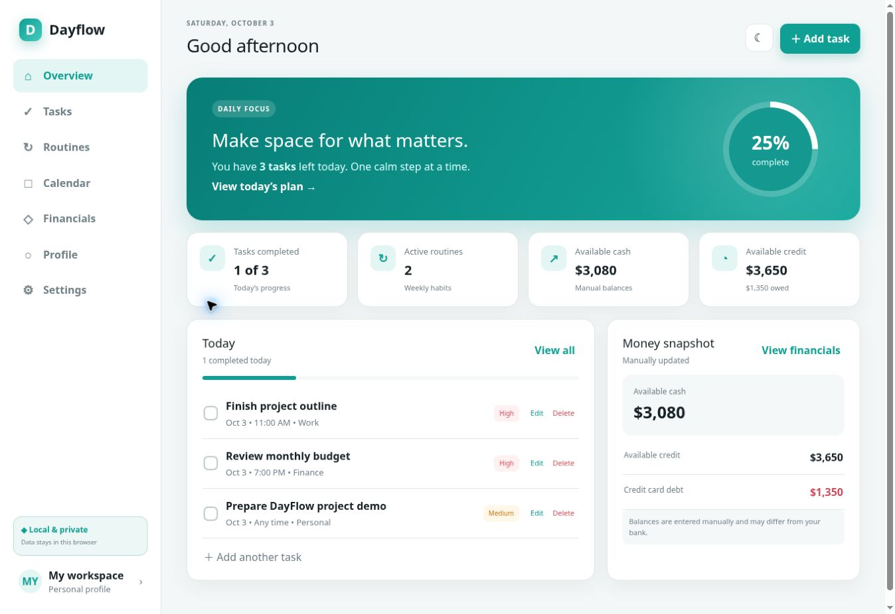
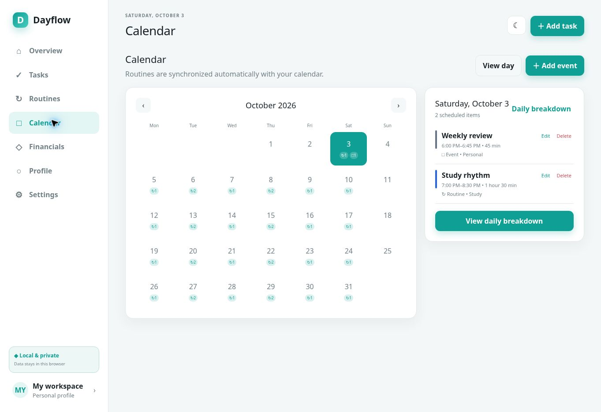
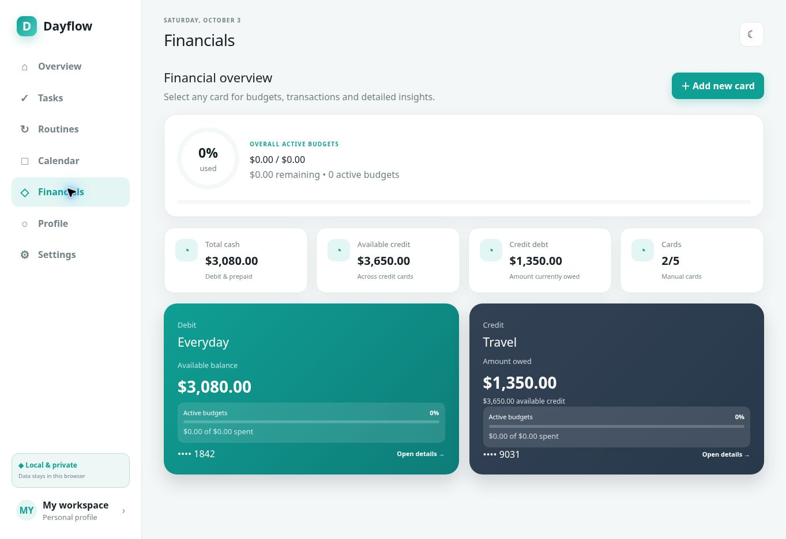
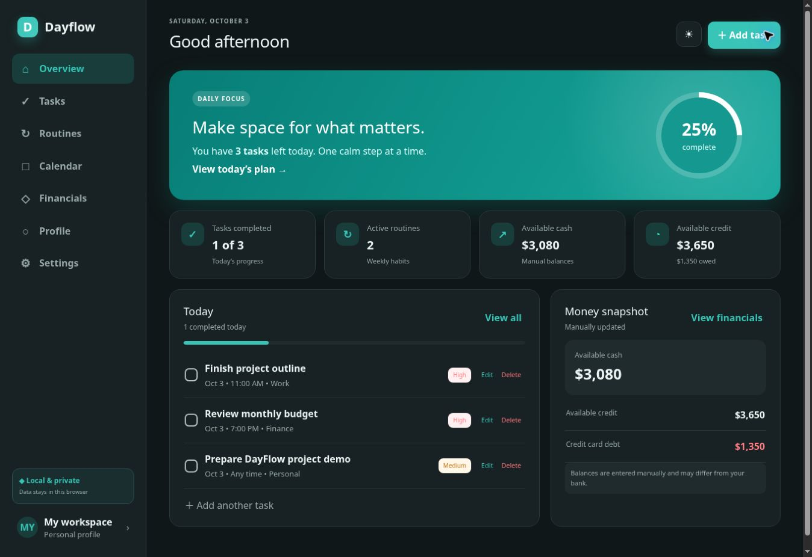

# DayFlow

A personal project bringing daily planning and manual money tracking into one place.

[Visit the website](https://pronto4056.github.io/dayflow-desktop/) · [Download Windows installer](https://github.com/Pronto4056/dayflow-desktop/releases/download/V1.0.0/DayFlow-Setup-1.0.0.exe) · [Release details](https://github.com/Pronto4056/dayflow-desktop/releases/tag/V1.0.0)

## Version 1.0.1 candidate

A reconstructed Windows build with bug fixes and an empty first-launch workspace is being prepared. See [build instructions](docs/BUILD.md) and [candidate release notes](docs/RELEASE-V1.0.1.md). It must pass the release gate before replacing the public download.

## Project status

DayFlow is an experimental personal project, built iteratively with AI-assisted development. Version 1.0.0 is available as an **unsigned Windows installer**. Feedback and reproducible bug reports are welcome.

**This repository contains the promotional website, recovered Electron entry points and compiled React interface, and a separate browser review build.** It does not contain the complete original TypeScript/TSX project or the configuration needed to reproduce the Windows installer. See [recovery details](recovered/README.md). GitHub source archives are repository snapshots, not a complete rebuildable desktop project.

**The downloadable 1.0.0 installer has known issues.** Isolated tests reproduce five failures involving local dates, month-end recurrence, negative debit balances, and unreadable-data recovery. Browser interaction also shows an incorrect task-completion denominator. Existing fixes in `review-build/` are separate from the installer; a new installer and Windows acceptance testing are still required.

The website includes a small, clearly labeled illustrative interactive demo. It is not the full application. Its example tasks reset on reload, and its calendar and financial figures are sample data. The separate full web prototype currently requires owner access.

## What DayFlow is designed to do

- Organize tasks, priorities, deadlines, and completed work.
- Schedule routines alongside calendar events and a daily timeline.
- Track manually entered card balances, budgets, transactions, and transfers.
- Offer local persistence and light/dark themes.

Fresh browser checks verified task creation, completion, restoration, reload persistence, and dark-theme persistence in the recovered packaged interface. Isolated tests exercised accounting, routines, dates, and timeline helpers. These checks do not establish Windows installation or desktop workflow readiness. See the [audit and test checklist](docs/AUDIT.md).

## Download and installation

1. Download **DayFlow-Setup-1.0.0.exe** from the release link above.
2. Verify the SHA-256 value below if you want to check file integrity.
3. Open the installer and follow its prompts on a 64-bit Windows 10 or Windows 11 computer.

Installer size: 144,241,594 bytes (approximately 137.6 MiB).

The installer is not digitally signed. Windows may show an unknown-publisher warning. A checksum match verifies integrity, not publisher identity or software safety. Only run software you trust.

Clean Windows installation, launch, persistence, shortcuts, updates, and uninstallation still need a fresh end-to-end test. A portable executable is **not attached to the public release**, despite the older release description mentioning one.

### Verify the download

In PowerShell, from the folder containing the installer:

```powershell
Get-FileHash .\DayFlow-Setup-1.0.0.exe -Algorithm SHA256
```

Expected SHA-256, also recorded in GitHub's release asset metadata:

```text
7d35283ec269e7436a5c2ca72cb1533c60dad311f676d7fc49e6967e31b8af0d
```

[Download the existing checksum file](https://github.com/Pronto4056/dayflow-desktop/releases/download/V1.0.0/DayFlow-1.0.0-SHA256.txt)

## Privacy and local data

The application was designed for manual finance tracking, without bank connections. Do not enter full card numbers, security codes, PINs, bank passwords, or real sensitive financial information when evaluating this release.

The recovered Electron main process sets the desktop data directory to `%APPDATA%\DayFlow`. Browser evaluation instead uses local storage under `dayflow-v2`. Confirm the desktop folder exists on your installation. Close the app before copying that folder for backup; keep the backup private. Backup restoration and update retention have not been reverified in this audit.

Local storage does not, by itself, establish encryption or protection from other users of the computer. This project does not claim an independent security audit, bank-grade encryption, cloud synchronization, or financial advice.

The landing page stores only its theme choice in browser local storage; demo tasks are held in memory.

## Technology and repository layout

| Component | Technology / availability |
| --- | --- |
| Public website | HTML, CSS, vanilla JavaScript |
| Website hosting | GitHub Pages, deployed with GitHub Actions |
| Desktop application | Recovered Electron main/preload scripts and compiled React interface; original TypeScript/TSX source and complete build configuration remain missing |
| Installer | Windows executable supplied through GitHub Releases |

```text
index.html                 Website and illustrative demo
.github/workflows/pages.yml  GitHub Pages deployment
scripts/check-website.cjs   Focused website source checks
recovered/app/             Original recovered distribution files
review-build/              Separately patched browser review build
scripts/check-app.cjs       Isolated original/review helper tests
docs/AUDIT.md               Evidence, limitations, and remaining tests
README.md                  Project overview
```

## Run the website locally

Clone or download this repository. Open `index.html` in a browser, or serve the folder with a static web server. For example, if Python is installed:

```sh
python -m http.server 8000
```

Then visit `http://localhost:8000`.

With Node.js installed, run the focused source checks:

```sh
node scripts/check-website.cjs index.html
```

No npm installation is needed for this landing page. To inspect the recovered interface, visit `http://localhost:8000/recovered/app/dist-desktop/`. To inspect the separately corrected interface, visit `http://localhost:8000/review-build/`. Run `node scripts/check-app.cjs` to compare isolated helper checks. Desktop build instructions require restoration of the original source and build configuration.

## Screenshots

These are captures of the actual recovered 1.0.0 application interface running in a browser with synthetic sample data. They are not Windows desktop captures or website demo mockups. The overview retains the original known completion-count issue.









## Reporting a problem

[Open an issue](https://github.com/Pronto4056/dayflow-desktop/issues) with the app version, Windows version, steps to reproduce, expected result, and actual result. Use sample data and redact any personal details in screenshots.

## Before a wider release

- Restore and review the complete app source and desktop build configuration.
- Run the app workflow and clean Windows checklist in the audit document.
- Capture and verify Windows desktop screenshots after rebuilding and acceptance testing.
- Reconcile the release notes with the assets actually published.
- Consider code signing for future releases.
