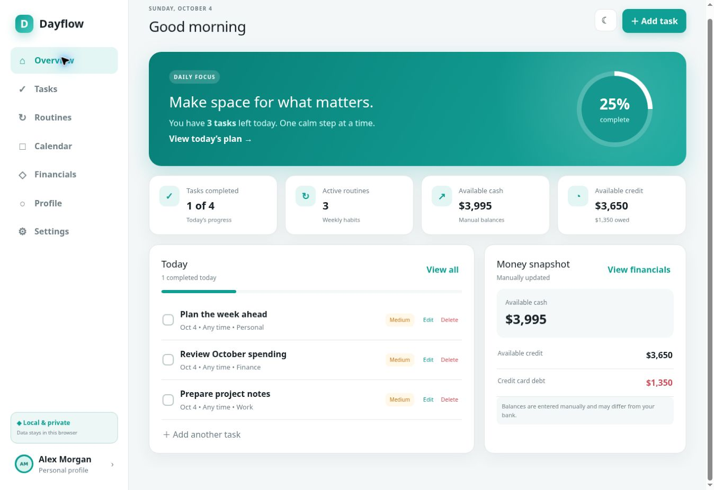
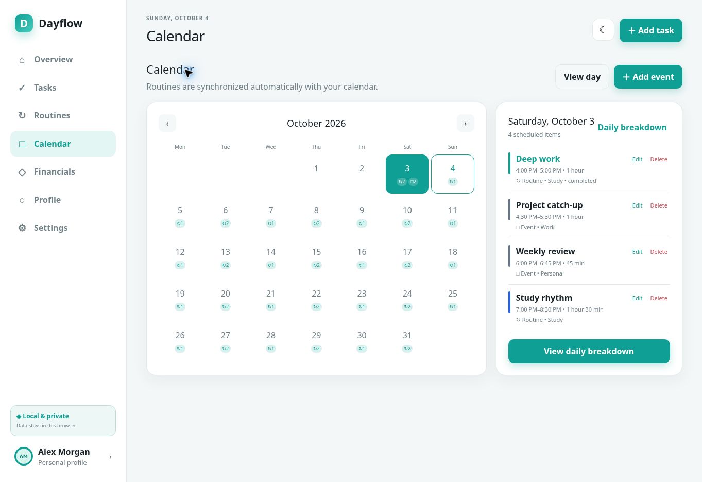
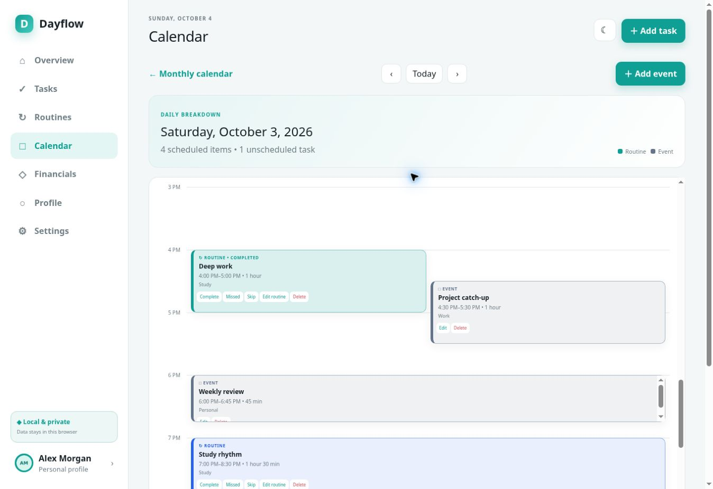
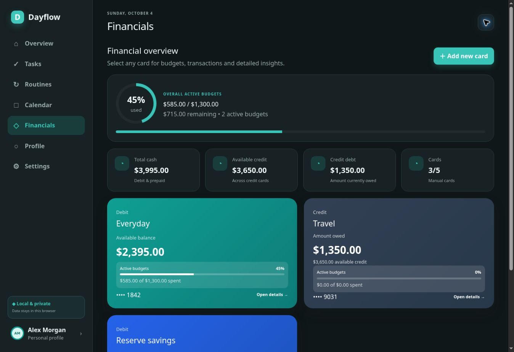
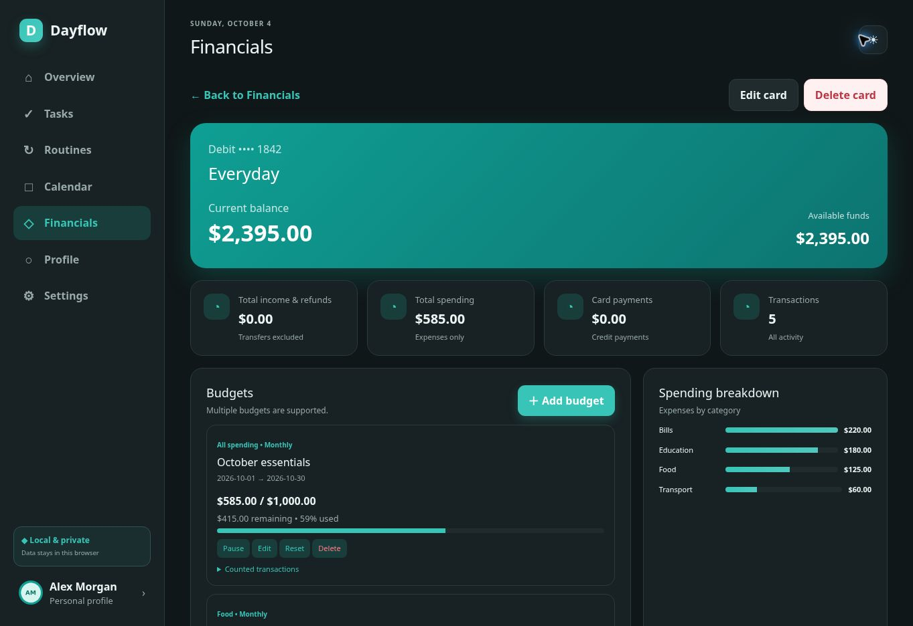

# DayFlow

A personal project combining daily planning with manual money tracking. Tasks, routines, a calendar and a daily timeline sit alongside cards, budgets and transaction history in a teal light/dark interface.

[Website](https://pronto4056.github.io/dayflow-desktop/) · [Try the browser review build](https://pronto4056.github.io/dayflow-desktop/review-build/) · [Windows release](https://github.com/Pronto4056/dayflow-desktop/releases/tag/V1.0.0) · [Review report](docs/AUDIT.md)

## Current status

DayFlow 1.0.0 is an **unsigned experimental Windows release**. The October review recovered the actual packaged application and tested its renderer in a browser. Several defects were corrected in a separate browser review build. **Those fixes are not included in the downloadable Windows installer.** Clean Windows installation, offline launch, updates and uninstallation still require testing. Evaluate the installer with sample data until these checks and an installer rebuild are complete.

## Screenshots

Real captures of the running application renderer in the browser review build, using fictional sample data. These are not native Windows captures or the landing page's illustrative demo.







## Features

- Tasks with deadlines, priorities, recurrence, completion timestamps, restoration and confirmed deletion.
- Weekly routines with days, time ranges, pause/resume and individual occurrence statuses.
- Monthly calendar and 24-hour Daily Breakdown with duration-based blocks and overlapping items.
- Up to five manually managed cards, multiple budgets, transaction history and transfers.
- Financial summaries, category spending, budget warnings and transaction recalculation.
- Profile editing, profile pictures, light/dark themes and confirmed account reset.
- Local persistence; no bank connection or AI integration in this version.

## Technologies and available files

The recovered interface is compiled JavaScript using React 19.2.6, HTML and CSS. The Electron shell uses JavaScript ES modules and a CommonJS preload. The promotional website uses HTML, CSS and JavaScript; Windows packaging is NSIS.

| Path | Contents |
| --- | --- |
| `index.html` | Promotional website and clearly labelled illustrative demo |
| `recovered/app/desktop/` | Original main process and preload recovered from the installer |
| `recovered/app/dist-desktop/` | Original compiled application renderer, unchanged |
| `recovered/app/package.json` | Packaged runtime manifest |
| `review-build/` | Corrected browser renderer with provenance hashes |
| `scripts/` | Guarded renderer recovery fixes and focused checks |
| `docs/` | Audit, release notes, checksum and real screenshots |

**This repository does not contain the complete original editable application project.** Original TS/TSX components, source maps, dependency lockfile, desktop build configuration, installer scripts and icon source have not been recovered. The packaged manifest is not a desktop build recipe. `npm install` cannot recreate the original installer from this repository. GitHub's automatic source archives at tag `V1.0.0` contain the older promotional website; current `main` includes the recovered files listed above. No portable executable is currently attached to the release.

A separate [`release/1.0.1` branch](https://github.com/Pronto4056/dayflow-desktop/tree/release/1.0.1) contains reconstructed desktop packaging, icons, a pinned lockfile and build instructions around the recovered renderer. It does not restore the original TSX project. Its installer built in Windows CI, but the acceptance test timed out while installing original 1.0.0. The candidate remains a draft; the green overall workflow status is not a passing acceptance result.

## Run the browser review locally

Clone this repository, then serve it with Python 3:

```sh
python -m http.server 8080
```

Open `http://localhost:8080/review-build/`. To regenerate the review build and run its focused checks, use Node.js:

```sh
node scripts/prepare-review-build.cjs recovered/app/dist-desktop review-build
node scripts/check-app.cjs
```

The generator verifies the exact original bundle hash and refuses incompatible inputs. It preserves the recovered originals. Browser data is separate from the installed Windows application's data; use one application tab at a time while reviewing.

## Windows installation

1. Download [DayFlow-Setup-1.0.0.exe](https://github.com/Pronto4056/dayflow-desktop/releases/download/V1.0.0/DayFlow-Setup-1.0.0.exe) from the release (144,241,594 bytes, about 138 MiB).
2. Optionally verify it in PowerShell with `Get-FileHash .\DayFlow-Setup-1.0.0.exe -Algorithm SHA256`.
3. Open the installer and follow its setup prompts. It is intended for 64-bit Windows 10/11. Windows SmartScreen may display an unknown-publisher warning because the executable is unsigned. Proceed only if you trust the source.
4. Launch DayFlow and evaluate it with sample data. Installer location selection, shortcuts, native launch and uninstallation still need Windows acceptance testing.

Expected installer SHA-256, also in [docs/SHA256SUMS.txt](docs/SHA256SUMS.txt):

```text
7d35283ec269e7436a5c2ca72cb1533c60dad311f676d7fc49e6967e31b8af0d
```

A checksum verifies download integrity; it does not establish publisher identity or software safety. The historical checksum asset also lists files that are not currently attached to the release.

## Privacy, backups and updates

Balances and transactions are entered manually. Do not enter full card numbers, CVVs, PINs or banking credentials. Financial values are estimates, not live bank balances.

The recovered Electron shell uses `%APPDATA%\DayFlow` as its user-data directory and loads the bundled interface locally. The renderer stores application state using local storage. No encrypted-storage or security-audit claim is made. Device access and operating-system security still matter.

For a desktop backup, fully close DayFlow and copy the entire `%APPDATA%\DayFlow` folder to a safe location. Keep a backup before updates or troubleshooting; retaining data through a real Windows update has not yet been verified. To restore, close the app before replacing its data folder from a compatible backup. Browser preview data is stored in that browser and can be removed when site data is cleared.

First launch includes sample tasks, routines and cards. **Reset Account clears personal state and restores these starter samples**, rather than leaving an empty workspace. It requires typing `RESET`. It is not a secure physical-erasure feature. Windows Settings → Apps → DayFlow is the expected uninstall route; verify uninstall/data retention on Windows before relying on it.

## Known limitations and review results

The review build fixes local date/month-end handling, end-of-month monthly recurrence, negative-balance clamping, unsafe startup overwriting after a failed data load, dashboard completion counts and stale Undo overwriting later changes. It also gives timeline blocks more readable space. Desktop versions of these fixes require a new installer.

Focused checks: **14/14 passed for the review build; 9/14 passed for the original renderer**. Browser interaction checks covered task lifecycle, recurring-task deletion, routine scheduling/calendar synchronization, event editing and overlap display, transaction edits/deletes/transfers, budget deletion, profile/photo save, themes, confirmed reset and persistence after refresh/tab reopening. See the [audit](docs/AUDIT.md) for exact scope and remaining tests.

Recurring tasks/events generate a finite set (120 daily, 52 weekly or 12 monthly occurrences). Budget period labels do not automatically roll dates forward. Reminder flags do not implement background OS notifications. Windows acceptance, mobile device testing, every recurrence deletion branch and encrypted-storage guarantees remain outside the verified scope.

## Feedback

Please [open an issue](https://github.com/Pronto4056/dayflow-desktop/issues) with the build used, operating system, steps, expected result and a screenshot without personal information. Do not attach real financial records or your complete data folder publicly.

The project was developed with AI coding assistance and iterative feature/interaction review. No project license has been declared; public availability alone does not grant an open-source license.
